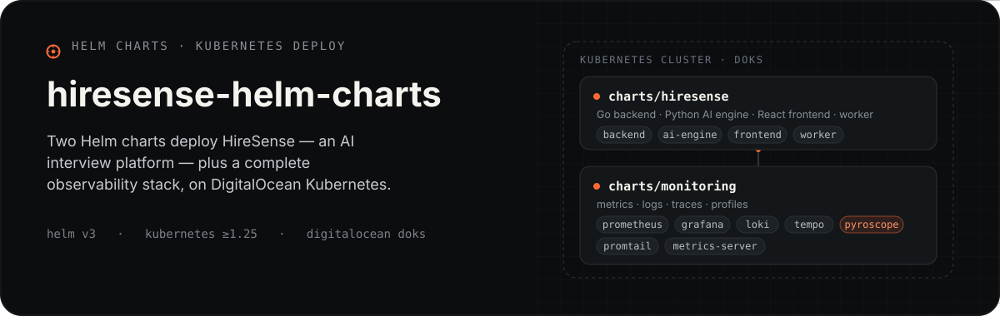
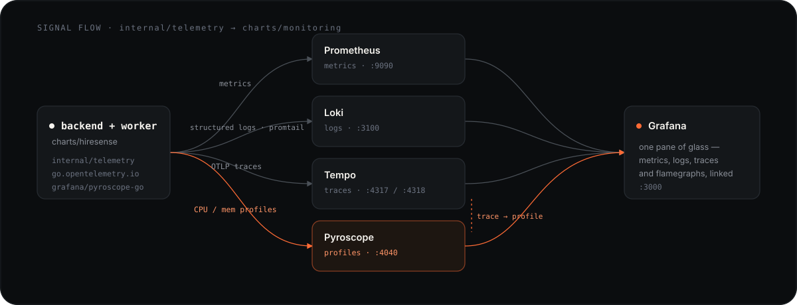

<p align="center">
  
</p>

Helm charts for deploying [HireSense](https://hiresense.dc-forte.com) — an AI interview platform — on DigitalOcean Kubernetes (DOKS).

## Charts

| Chart | Description |
|-------|-------------|
| `charts/hiresense` | App: Go backend, Python AI engine, React frontend, worker |
| `charts/monitoring` | Observability: Prometheus, Grafana, Loki, Tempo, Promtail, Pyroscope, metrics-server |
| `charts/recruiter-report` | Standalone recruiter-report service — own namespace/DB/TLS cert per env, reusing this same cluster. See [`RECRUITER_REPORT_EXTRACTION_PLAN.md`](https://github.com/DC-Forte/chapter-interview-backend-go/blob/develop/RECRUITER_REPORT_EXTRACTION_PLAN.md) in the backend repo. |
| `charts/interviewhandoff` | Standalone interview-engine service (LiveKit provisioning + candidate practice flow) — ClusterIP-only, no public ingress; own DB schema on the *shared* hiresense Postgres instance, not a separate DB cluster. |
| `charts/matchengine` | Standalone resume↔JD matching + rubric service, called by both `hiresense` and `interviewhandoff` — ClusterIP-only; own schema on the same shared instance. |

### Namespaces

One shared cluster, one namespace per release (`recruiter-report` deploys twice — staging and prod are fully separate namespaces, not one namespace with an env label):

| Namespace | Release | Chart |
|-----------|---------|-------|
| `hiresense-app` | `hiresense` | `charts/hiresense` |
| `monitoring` | `monitoring` | `charts/monitoring` |
| `recruiter-report-staging` | `recruiter-report-staging` | `charts/recruiter-report` |
| `recruiter-report-prod` | `recruiter-report-prod` | `charts/recruiter-report` |
| `interviewhandoff-staging` | `interviewhandoff` | `charts/interviewhandoff` |
| `matchengine-staging` | `matchengine` | `charts/matchengine` |
| `istio-system` | (cluster-managed, not this repo) | — TLS `Certificate`/Secret for `recruiter-report` lives here too, see the cross-namespace TLS gotcha below |

`interviewhandoff`/`matchengine` are staging-only — no prod environment exists yet for the
hiresense monolith or anything extracted from it (`recruiter-report` is the one service in this
platform with a real staging/prod split). Don't add `values-prod.*` files or a `-prod` namespace
for either until that changes.

## How it observes itself

The backend and worker (both Go) push every signal into the monitoring chart, correlated in one Grafana:

<p align="center">
  
</p>

- **Metrics** → Prometheus scrapes app `ServiceMonitor`s in any namespace.
- **Logs** → structured JSON via Promtail → Loki; correlates with traces via `trace_id`.
- **Traces** → OTLP (gRPC `:4317` / HTTP `:4318`) → Tempo.
- **Profiles** → continuous CPU/memory/goroutine profiling → Pyroscope; flamegraphs click through directly from a Tempo span.
- **Grafana** at `grafana.dc-forte.com` ties all four together with pre-loaded dashboards.

## Prerequisites

- DOKS cluster (or any K8s ≥ 1.25)
- `kubectl` + `helm` v3 configured against the cluster
- Istio installed in the cluster (provides ingress)
- cert-manager installed (provides TLS via Let's Encrypt)
- Container images published to `ghcr.io/dc-forte`

```bash
helm repo add prometheus-community https://prometheus-community.github.io/helm-charts
helm repo add grafana              https://grafana.github.io/helm-charts
helm repo add metrics-server       https://kubernetes-sigs.github.io/metrics-server/
helm repo update
```

## Quick start (dev / local)

```bash
helm dep update charts/monitoring
helm dep update charts/hiresense

kubectl create namespace monitoring
kubectl create namespace hiresense-app

helm upgrade --install monitoring ./charts/monitoring -n monitoring
helm upgrade --install hiresense  ./charts/hiresense  -n hiresense-app
```

## Production deploy

Copy the secrets example, fill in real values (never commit the secrets file):

```bash
cp charts/hiresense/values-prod.secrets.example.yaml  charts/hiresense/values-prod.secrets.yaml
cp charts/monitoring/values-prod.secrets.example.yaml charts/monitoring/values-prod.secrets.yaml
# edit both files
```

Deploy:

```bash
# Observability stack first (Prometheus + metrics-server must be up before app ServiceMonitors)
helm upgrade --install monitoring ./charts/monitoring -n monitoring \
  -f charts/monitoring/values-prod.yaml \
  -f charts/monitoring/values-prod.secrets.yaml

# App
helm upgrade --install hiresense ./charts/hiresense -n hiresense-app \
  -f charts/hiresense/values-prod.yaml \
  -f charts/hiresense/values-prod.secrets.yaml
```

## Deploying `charts/recruiter-report`

Standalone chart, not a subchart of `charts/hiresense` — own namespace, own DB, own TLS cert per env (`staging`/`prod`), same shared cluster. `scripts/bootstrap-recruiter-report.sh <staging|prod> <namespace|postgres|deploy|verify|all>` parameterizes the same namespace/DB/deploy steps `scripts/` already has for the main app, scoped to this service.

```bash
./scripts/bootstrap-recruiter-report.sh staging namespace
./scripts/bootstrap-recruiter-report.sh staging postgres   # provisions a dedicated DO PG cluster + DB
# populate charts/recruiter-report/values-staging.secrets.yaml, run cmd/recruiterreportmigrate up
./scripts/bootstrap-recruiter-report.sh staging deploy <image-tag>
```

**Cross-namespace TLS gotcha worth knowing before touching this chart:** classic Istio `Gateway` CRD resolves `credentialName` against the ingress gateway *workload's* namespace (`istio-system` here), not the `Gateway` resource's own namespace. `templates/cert-issuer.yaml` deliberately creates the `Certificate` (and its resulting Secret) in `.Values.tls.gatewayNamespace` (`istio-system`), not the chart's own namespace — putting it in the app namespace produces a Secret Istio can never find, which manifests as TLS handshakes resetting on `ClientHello` with `secret istio-system/<name> not found` in istiod's logs. Confirmed by checking where the existing `hiresense-tls` secret actually lives (`istio-system`, not `hiresense-app`) despite that `Gateway` object living in `hiresense-app`.

Also unlike `charts/hiresense`'s `Gateway`, this chart's port-80 server does **not** set `tls.httpsRedirect` — that's a blanket per-listener setting with no path exceptions, and it breaks cert-manager's own HTTP-01 self-check (redirects the ACME challenge request into a TLS handshake with no cert issued yet → connection reset, cert never issues). `manageCertManager: false` on `charts/hiresense` sidesteps this because its cert was manually adopted, not issued through this flow.

**⚠️ `image.tag` drift — read before running a plain `helm upgrade` on this chart.** `values.yaml`'s `image.tag: latest` is a placeholder. The real running tag is set out-of-band by CI's `kubectl set image` (`build-recruiterreport.yml`) — prod pins a commit SHA (e.g. `ffc97df`), staging tracks a mutable `:staging` tag. Helm has no idea this happened, so **any `helm upgrade` without `--set image.tag=...` silently reverts to `latest` — a tag that was never pushed — and breaks the running pods** (`ErrImagePull`/`ImagePullBackOff`). This bit us doing an unrelated monitoring change; see issue #16 in `RECRUITER_REPORT_EXTRACTION_ISSUES.md`. Always pass the real tag:

```bash
# read the real tag off a live pod first
kubectl get pod -n recruiter-report-prod -l app=recruiter-report \
  -o jsonpath='{.items[0].spec.containers[0].image}'

helm upgrade recruiter-report-prod ./charts/recruiter-report -n recruiter-report-prod \
  -f charts/recruiter-report/values.yaml \
  -f charts/recruiter-report/values-prod.yaml \
  -f charts/recruiter-report/values-prod.secrets.yaml \
  --set image.tag=<real-tag-from-above> \
  --force-conflicts
```

**Monitoring:** `monitoring.serviceMonitor.enabled: true` (chart default) — Prometheus picks it up cluster-wide (`serviceMonitorNamespaceSelector: {}` in `charts/monitoring`). Dashboard lives in `charts/monitoring/templates/dashboards.yaml` (uid `recruiter-report`, folder `HireSense`) — HTTP enqueue rate/latency/errors, Go runtime, pod health, logs, both namespaces overlaid by legend. Redeploying it is a `charts/monitoring` upgrade (see below), not this chart.

## Deploying `charts/interviewhandoff` and `charts/matchengine`

Both standalone, ClusterIP-only, no TLS/Istio Gateway needed (every caller is in-cluster). Unlike
`charts/recruiter-report`, neither has its own DB cluster — both share the monolith's existing
Postgres instance, each with its own schema + scoped DB role
(`interviewhandoff_app`/`matchengine_app`) and cross-schema read-only `GRANT`s onto tables other
services own. See `chapter-interview-backend-go`'s root README ("Database Migrations" section) for
the schema/role/GRANT mechanics.

Bootstrap (first deploy only — after this, CI's `kubectl set image` rolling-deploy path takes
over, same as `recruiter-report`):

```bash
# 1. Migrate + backfill each service's own schema (run from chapter-interview-backend-go)
DB_URL="<staging DSN>" go run ./cmd/interviewhandoffmigrate up
go run ./cmd/interviewhandoffbackfill --monolith-dsn="<staging DSN>" --interviewhandoff-dsn="<staging DSN>"
DB_URL="<staging DSN>" go run ./cmd/matchenginemigrate up
go run ./cmd/matchenginebackfill --monolith-dsn="<staging DSN>" --matchengine-dsn="<staging DSN>"

# 2. Create each service's DB role + run its GRANT scripts (see <service>migrations/ops/*.sql)

# 3. Populate secrets (copy shared values — encryptionKey/candidateJwtSecret/openaiApiKey/LiveKit
#    creds — from charts/hiresense/values-prod.secrets.yaml; they must match the monolith's)
cp charts/interviewhandoff/values-staging.secrets.example.yaml charts/interviewhandoff/values-staging.secrets.yaml
cp charts/matchengine/values-staging.secrets.example.yaml charts/matchengine/values-staging.secrets.yaml
# edit both files

# 4. Helm install (creates the namespace)
helm upgrade --install matchengine ./charts/matchengine -n matchengine-staging --create-namespace \
  -f charts/matchengine/values.yaml -f charts/matchengine/values-staging.yaml -f charts/matchengine/values-staging.secrets.yaml
helm upgrade --install interviewhandoff ./charts/interviewhandoff -n interviewhandoff-staging --create-namespace \
  -f charts/interviewhandoff/values.yaml -f charts/interviewhandoff/values-staging.yaml -f charts/interviewhandoff/values-staging.secrets.yaml

# 5. Copy the ghcr-pull image-pull secret and create the ci-deployer RoleBinding in each new
#    namespace — neither crosses namespaces automatically, same gotcha as recruiter-report:
kubectl get secret ghcr-pull -n recruiter-report-staging -o json \
  | python3 -c "import json,sys; d=json.load(sys.stdin); d['metadata']={'name':'ghcr-pull','namespace':'matchengine-staging'}; print(json.dumps(d))" \
  | kubectl apply -f -
kubectl create rolebinding ci-deployer-rb --clusterrole=edit \
  --serviceaccount=hiresense-app:ci-deployer -n matchengine-staging
# repeat both for interviewhandoff-staging

# 6. Push to the `staging` branch (or trigger workflow_dispatch) — build-matchengine.yml /
#    build-interviewhandoff.yml build+push the image and roll the deployment.
```

Deploy `matchengine` before `interviewhandoff` — `interviewhandoff` calls it over HTTP
(`MATCHENGINE_URL`), so it should already be reachable, though a transient startup-order race is
harmless since neither retries hard at boot.

## Common commands

Release names ≠ chart names — `helm list -A` to confirm before upgrading anything:

```bash
helm list -A
# hiresense                  hiresense-app             (chart: hiresense)
# monitoring                 monitoring                (chart: hiresense-monitoring)
# recruiter-report-staging   recruiter-report-staging  (chart: recruiter-report)
# recruiter-report-prod      recruiter-report-prod     (chart: recruiter-report)
# matchengine                matchengine-staging       (chart: matchengine)
# interviewhandoff           interviewhandoff-staging  (chart: interviewhandoff)
```

Redeploy the app (prod):

```bash
helm upgrade hiresense ./charts/hiresense -n hiresense-app \
  -f charts/hiresense/values-prod.yaml \
  -f charts/hiresense/values-prod.secrets.yaml \
  --force-conflicts   # kubectl set image (CI) and helm both own spec.template — see recruiter-report note above, same pattern here
```

Redeploy monitoring (dashboards, alerting rules, Prometheus/Grafana config):

```bash
helm upgrade monitoring ./charts/monitoring -n monitoring \
  -f charts/monitoring/values-prod.yaml \
  -f charts/monitoring/values-prod.secrets.yaml \
  --force-conflicts
```

Redeploy recruiter-report (staging/prod) — **always pin `image.tag`, see the drift warning above**:

```bash
kubectl get pod -n recruiter-report-<env> -l app=recruiter-report \
  -o jsonpath='{.items[0].spec.containers[0].image}'   # read real tag first

helm upgrade recruiter-report-<env> ./charts/recruiter-report -n recruiter-report-<env> \
  -f charts/recruiter-report/values.yaml \
  -f charts/recruiter-report/values-<env>.yaml \
  -f charts/recruiter-report/values-<env>.secrets.yaml \
  --set image.tag=<real-tag> \
  --force-conflicts
```

Check what's actually running / restarting:

```bash
kubectl get pods -n hiresense-app
kubectl get pods -n recruiter-report-staging
kubectl get pods -n recruiter-report-prod
kubectl get pods -n matchengine-staging
kubectl get pods -n interviewhandoff-staging
kubectl rollout status deployment/<name> -n <namespace>
kubectl rollout undo deployment/<name> -n <namespace>   # fastest rollback if a bad rollout is serving traffic
```

Confirm a ServiceMonitor is actually being scraped (don't assume — `enabled: true` in values doesn't mean Prometheus found it):

```bash
kubectl get servicemonitor -n <namespace>
# then, via Grafana's Prometheus datasource (uid "prometheus"):
#   up{namespace="<namespace>"}   → 1 per pod means scraping; empty result means it isn't
```

Tail logs without waiting on Loki's scrape/ingest delay:

```bash
kubectl logs -n <namespace> -l app=<app-label> -f --tail=100
```

## Secrets

Secrets are injected at deploy time via `values-prod.secrets.yaml` (gitignored).
The example files document every required key — fill from `terraform output` or your secrets manager.

| Key group | Source |
|-----------|--------|
| DB / Redis URLs | DigitalOcean managed databases |
| JWT / session secrets | `openssl rand -hex 32` |
| OpenAI, LiveKit, SMTP | Respective dashboards |
| DO Spaces keys | DigitalOcean → API → Spaces Keys |

## CI / releases

Pushing to `main` under `charts/**` triggers [chart-releaser](https://github.com/helm/chart-releaser-action), which packages charts and publishes them to the `gh-pages` branch as a Helm repo.

To consume a released chart:

```bash
helm repo add dc-forte https://dc-forte.github.io/hiresense-helm-charts
helm repo update
helm install hiresense dc-forte/hiresense -n hiresense-app -f your-values.yaml
```

## Using Luxury Yacht

[Luxury Yacht](https://github.com/luxury-yacht/app) is a cross-platform desktop app for browsing and managing Kubernetes clusters. It connects to your cluster via your existing kubeconfig and provides a real-time view of workloads, pods, logs, and resource metrics.

### Connect

Point it at the same kubeconfig you use with `kubectl`:

```
~/.kube/config   (default; DOKS context is added by: doctl kubernetes cluster kubeconfig save <cluster-name>)
```

Open Luxury Yacht, select the cluster from the context list, and it connects immediately.

### Resource metrics (CPU / memory)

Luxury Yacht queries `metrics.k8s.io` (the Kubernetes Metrics API) to display live CPU and memory usage per node and pod. This API is served by **metrics-server**, which is included in the monitoring chart.

If you see:

> **Metrics API not found! metrics-server may not be installed in the cluster.**

metrics-server is not running. Deploy or upgrade the monitoring chart:

```bash
helm dep update charts/monitoring
helm upgrade --install monitoring ./charts/monitoring -n monitoring \
  -f charts/monitoring/values-prod.yaml \
  -f charts/monitoring/values-prod.secrets.yaml

# Verify
kubectl -n monitoring rollout status deployment metrics-server
kubectl top nodes
```

DOKS-specific note: the monitoring chart already sets `--kubelet-preferred-address-types=InternalIP` so metrics-server can reach DOKS nodes without TLS issues.

### Useful views

| View | What to look for |
|------|-----------------|
| Nodes | CPU / memory utilisation per node (needs metrics-server) |
| Workloads → hiresense-app | Pod restarts, image tags, replica counts |
| Workloads → monitoring | Prometheus, Grafana, Loki, Tempo, Pyroscope health |
| Logs | Live pod logs (backed by the Kubernetes log API, not Loki) |
| Services | Istio gateway, backend, AI engine endpoints |
